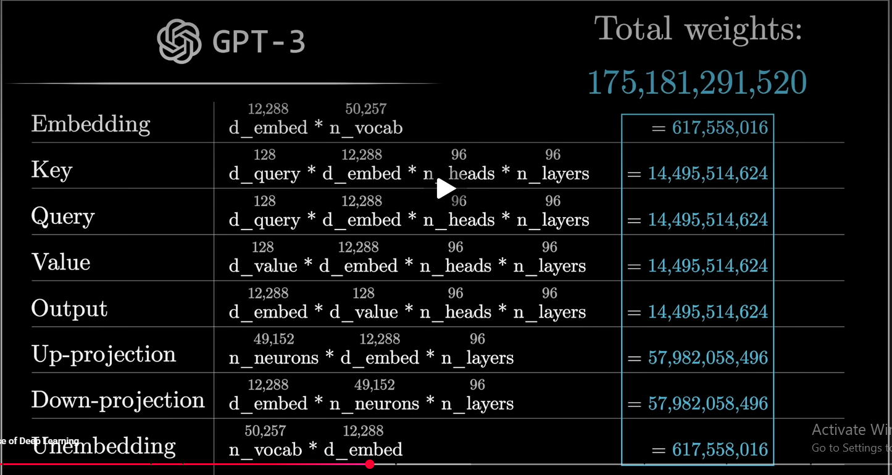

# Learning Notes
## Deep learning basics
### Reference
- https://www.3blue1brown.com/?topic=neural-networks
- https://cs231n.github.io/optimization-2/
- https://www.deeplearningbook.org/
- http://neuralnetworksanddeeplearning.com/

## Language modeling & tokenization
A language model defines a probability distribution over token sequences. Using the chain rule of probability.

$$P(x_1,...，x_T)=\prod_{t-1}^TP(x_t|x_1,...,x_{t-1})$$

An autoregressive LLM learns exactly the conditional probability $$P(x_t|x_{<t})$$. Training maximizes log-likelihood, equivalently minimized cross-entropy.

- Tokens: text is split into subword units (byte-pair encoding). Not words, not characters, but something in between.
- Embeddings: each token id maps to a vector in $\mathbb{R}^d$. The model operates on these vectors.

Links:
- [speech and language processing](https://web.stanford.edu/~jurafsky/slp3/)
- https://huggingface.co/docs/transformers/tokenizer_summary

## The transformer

Previous DL models: sequential -> Transformer, attention, parrallel.
Entire context, Attention -> Feed forward -> Attention -> Feed forward -> ... -> probability for next word

**Self-intention** is the key mechanism. Given an input matrix $X\in\mathbb{R}^{T\times d}$(T Tokens, dimension d), we compute three linear projections:
$$Q=XW_Q, K=XW_Km, V=XW_V$$
Then attention is:
$$Attention(Q, K, V) = softmax(\frac{QK^T}{\sqrt{d_k}})V$$

Intepretation:
- $QK^T$ is T*T matrix of similarity scores (dot products) between every pair of tokens
- softmax over each row turns scores into a convex combination (weights summing to 1)
- Output is a weighted average of value vectors - each token gathers information from others
- $\sqrt{d_k}$ sclaing keeps the dot products from growing with dimension (variance control)

**Multi-head attention**: run $h$ attention operations in parallel with different projections, then concatenate. Let the model attend to different relationship types simultaneously.

Other components:
- Positional encodings: attention is permutation-invariant, so position info must be injected (sinusoidal, learned, or RoPE)
- Feed-forward network (per-token MLP), residual connections, layer norm

Links:
- https://jalammar.github.io/illustrated-transformer/
- https://nlp.seas.harvard.edu/annotated-transformer/
- Attention is All you need
- Attention in transformers: https://www.youtube.com/watch?v=eMlx5fFNoYc
- Anthropic: [Top model of superposition](https://transformer-circuits.pub/2022/toy_model/index.html)
- Anthropic: [Towards Monosemanticity: decomposing language models with dictionary learning](https://transformer-circuits.pub/2023/monosemantic-features)

## Encoder vs. decoder
Three architectural families

|Type|Attention|Examples|Use case|
|--|--|--|--|
|Encoder-only|Bidirectional (sees full context)|BERT|Understanding / classification, embeddings|
|Decoder-only|Causal / masked (only see past)|GPT, Llama|Generation (LLM)|
|Encoder-decoder|Encoder bidirectional + decoder causal + cross-attention|T5, original transformer|Translation, seq-to-seq|

Causal masking: in decoder self-attention, we add a mask $M$ before softmax where future positions get $-\infty$:

$$\text{softmax}\!\left(\frac{QK^\top}{\sqrt{d_k}} + M\right), \quad M_{ij} = \begin{cases} 0 & j \le i \\ -\infty & j > i \end{cases}$$
This enforces that token $i$ can only attend to tokens $\le i$, preserving the autoregressive factorization.

Links:
- https://huggingface.co/learn/llm-course/chapter1/4

## Inference: prefill + decode
When you give LLM a prompt and it generates a response:

**Prefill phase**
- entire prompt (all $T$ tokens) is processed in one forward pass - parallelizable, compute-bound
- The model computes and caches the Key and Value vectors for every token -> the **KV cache**

**Decode phase**
- Tokens are generated one at a time (autoregressive), each depending on all previous tokens
- For each new token, instead of recomputing attention over the whole sequence, we reuse the cached K/V and only copute Q/K/V for the single new token
- This is memory-bandwith-bound and inherently sequential - it is why generation feels slower than prompt ingestion

**Why the KV cache matters**: without it, generating token $t$ wound re-process all $t-1$ previous tokens, which is $O(T^2)$ redundant work. The cache makes each decode step $O(T)$ instead.

**Sampling** (how the next token is chosen from the distribution): greedy, temperature, top-k, top-p (nucleus). Temperature $\tau$ rescales logits $z$ before softmax:

$$P(x_i) = \frac{e^{z_i/\tau}}{\sum_j{e^{z_j/\tau}}}$$

Lower $\tau$ -> sharper / more deterministic; higher $\tau$ -> more random

Links:
- https://huggingface.co/docs/transformers/en/kv_cache
- https://huggingface.co/blog/how-to-generate
- https://www.anyscale.com/blog/continuous-batching-llm-inference

## Training & alignment
- Pretraining: next-token prediction on massive text corpora (self-supervised)
- Fine-tuning / instruction tuning: adapt to follow instructions
- RLHF / DPO: reinforced learning with human feedback (RLHF), align outputs with human preferences
- Scaling laws: loss decreases predictably as a power law in model size, data, and compute

Links:
- [Let's build GPT](https://www.youtube.com/watch?v=kCc8FmEb1nY)
- [Intro to LLMs](https://www.youtube.com/watch?v=zjkBMFhNj_g)
- [Scaling Laws for Neural Language Models](https://arxiv.org/abs/2001.08361)

